# Health indicators using image recognition and your urine

The aim of this project is to analyse a urine test strip with image recognition. The purpose of this is to read test results automatically and store them in a database for long terms statistics and health recommendations. Further more it helps me to learn more about image recognition and the use of a micro computer.

The architecture below shows the current prototype. A Raspberry Pi is used with the Pi camera module V1.3. The communication between the image recognition environment and the Pi is via Wifi. The OpenCV environment is running in Python which is used to determine the RGB colours of the test strip.


## Architecture 

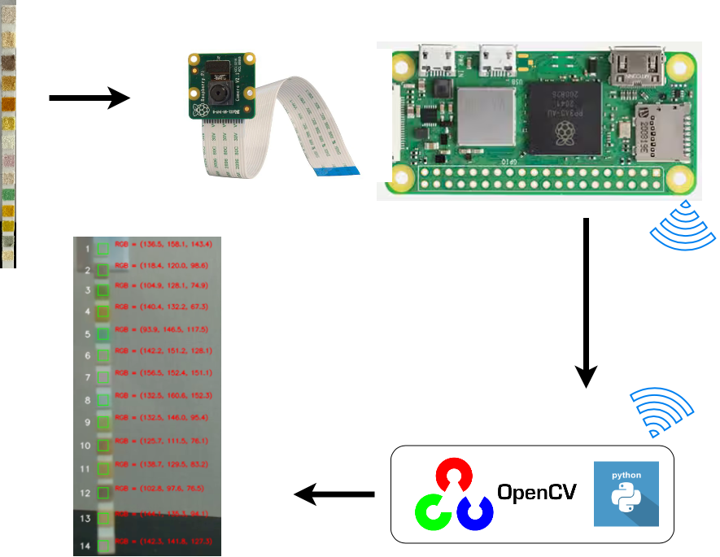

The test structure was printed in a way that it can be clipped on the top of the bathroom sink in a way that the test strip is hanging after use over the sink (see below). This way the colours can be determined with the Raspberry Pi in a hygienic way.

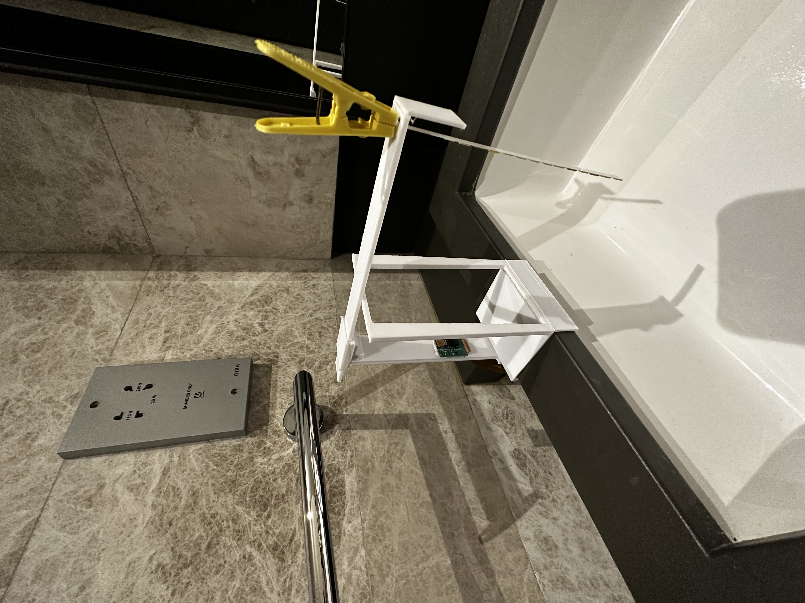

## Test results

The results below show a first test. The left picture shows a strip not used and the right picture shows a non-used strip (left) and a used strip (right).

Test construction |  Unused and used strip
:-------------------------:|:-------------------------:
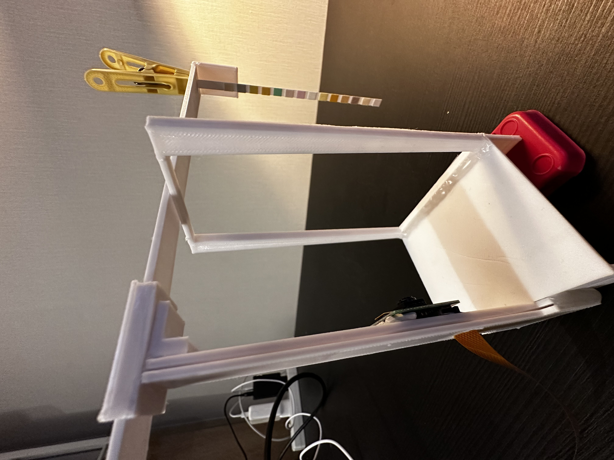   | 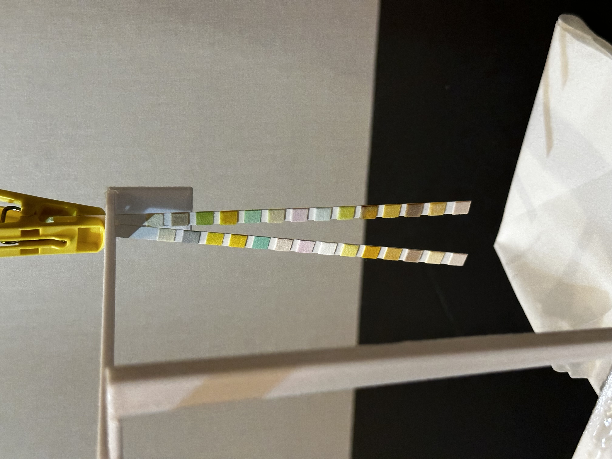 

Comparing the used and unused strip makes clear that the difference is colours is already very difficult to spot for the most squares with the eye. The low resolution Pi camera has even more difficulties with it.

It seems the PH measurement is quite obvious. The level is 6.5 (see below) by visual comparison. 

Test table |  Test sample
:-------------------------:|:-------------------------:
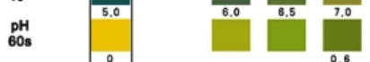   | 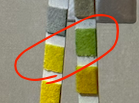 

The not used strip has the RGB values (138.0, 137.5, 80.2) which is a olive green and the used strip has the RGB values (104.9, 128.1, 74.9) which is a darker green. This difference is strong enough that it can be detected but other colours might change too slightly to be detected accurately.

Unused strip |  Used strip
:-------------------------:|:-------------------------:
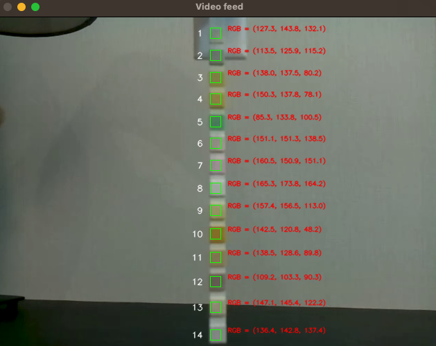   | 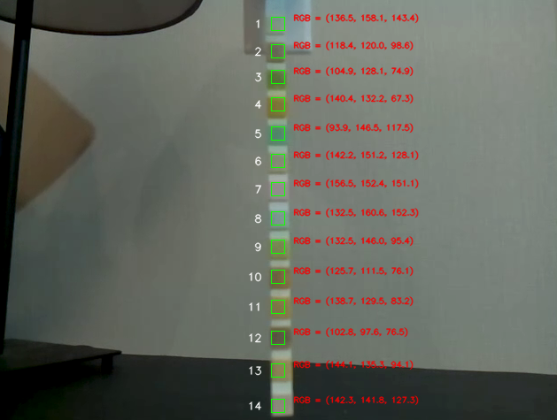 

**Test table to read the measurements**

The table below is from the urine strip package and can be used to determine the concentration of the indicators. 

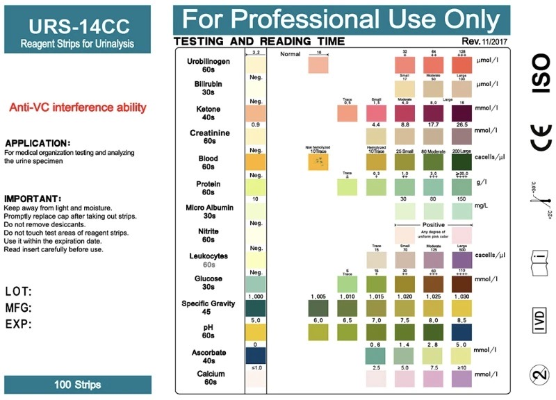

The picture below shows how the pre-prototype was tested. This was the first test on how to do image recognition with the Pi camera. 

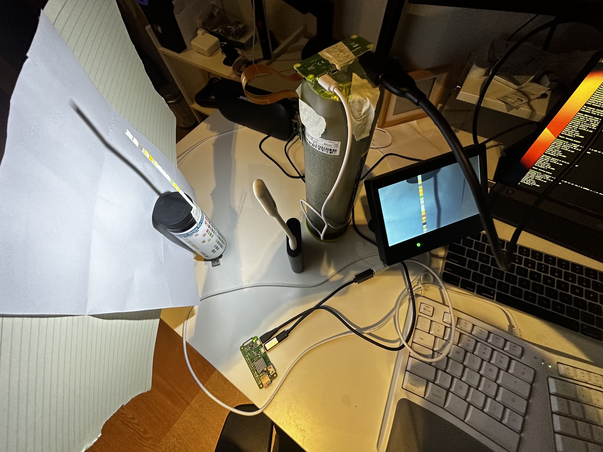

## 3D printer of test object holder

As mentioned before the construction was created in a way to be used on the top of the bathroom sink with the Pi camera. It was designed in Fusion360 and printed on a 3D printer (see below). 

Base | Test object arms | Test arms pillar
:-------------------------:|:-------------------------:|:-------------------------:
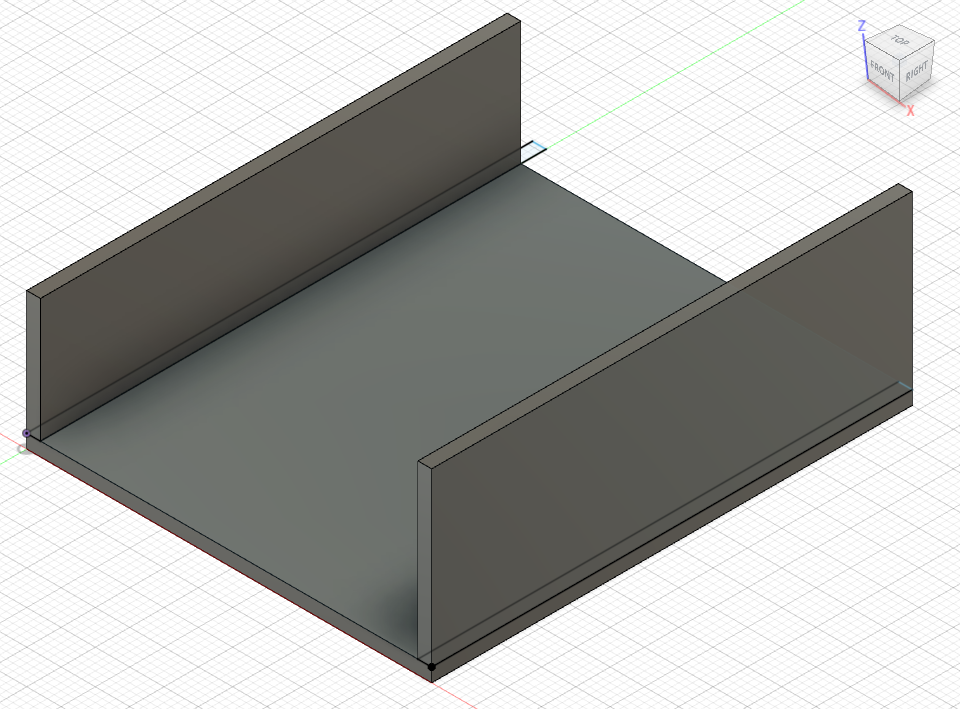 |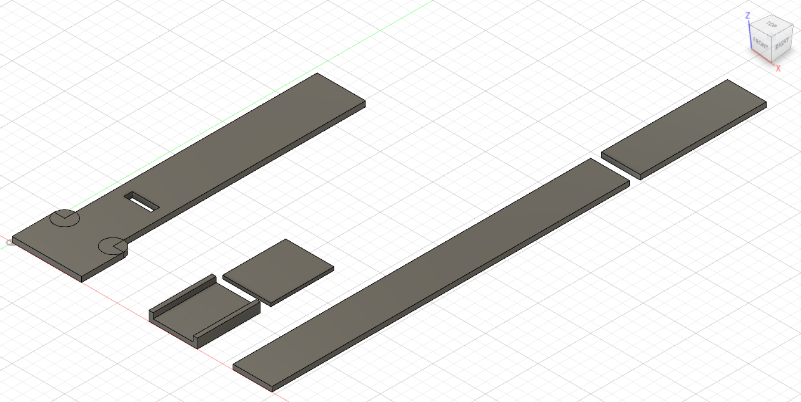   |  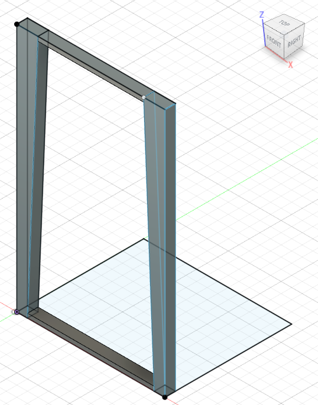 


## Code example

Making the Raspberry Pi camera accessible via the network
` raspivid -t 0 -w 640 -h 480 -hf -ih -fps 5 -b 4000000 -o - | nc -lkv4 8080`


This example shows in general on how to use the Pi camera to stream to the OpenCV Python environment.

```
import cv2

# Replace <raspberry-pi-ip-address> with the IP address of your Raspberry Pi
url = 'http://<raspberry-pi-ip-address>:8080/video'

# Open the video stream
cap = cv2.VideoCapture(url)

while True:
    # Read the frame
    ret, frame = cap.read()

    # Display the frame
    cv2.imshow('frame', frame)

    # Exit if 'q' is pressed
    if cv2.waitKey(1) & 0xFF == ord('q'):
        break

# Release the capture and destroy the window
cap.release()
cv2.destroyAllWindows()
```


**Alternatives** 

Taking a picture and getting it via a web server on a different machine. This does not uses the live stream of the Pi camera to determine the RGB colours it uses a static picture which then can be used in OpenCV. 

```
sudo apt-get install fswebcam
fswebcam -r 640x480 --no-banner /tmp/camera.jpg
python -m http.server 8080 --directory /tmp
```

Use a picture file with OpenCV

```
# Load the image file
frame = cv2.imread("test_strip.jpg")
```

Another alternative is for testing to use the PC web cam with OpenCV

```
# Create a video capture object for the default webcam
cap = cv2.VideoCapture(0)

```


## Full code for this project

The code below was used in this project to detect the RGB colours.

```
import cv2
import numpy as np

pi_ip= "192.168.1.111" #<----- Change!!!

# Define the dimensions of the test strip
num_squares = 14
square_size = 15

# Define the coordinates of the squares manually
x_axis = 311

squares = [[x_axis, 20], [x_axis, 51], [x_axis, 80], [x_axis, 111], [x_axis, 144], [x_axis, 175], [x_axis, 207], [x_axis, 240], [x_axis, 272], [x_axis, 306], [x_axis, 340], [x_axis, 375], [x_axis, 412], [x_axis, 452]]

# Address of your Raspberry Pi
url = 'http://'+pi_ip+':8080/video'

# Open the video stream
cap = cv2.VideoCapture(url)

# Define a function to display the image
def show_image(image, title="Image"):
    cv2.imshow(title, image)
    cv2.waitKey(1)

# Loop over frames from the video feed
while True:
    # Capture a frame from the video feed
    ret, frame = cap.read()

    # Resize the frame to a smaller size for faster processing
    #frame = cv2.resize(frame, (640, 480))
        
    # Apply gamma correction to the frame
    gamma = 1.2
    invGamma = 1.0 / gamma
    table = np.array([((i / 255.0) ** invGamma) * 255
                      for i in np.arange(0, 256)]).astype("uint8")
    frame = cv2.LUT(frame, table)
    
    # Loop over each square in the test strip and print its colour shade
    for i in range(num_squares):
        x, y = squares[i]
        square = frame[y:y+square_size, x:x+square_size, :]
        avg_color_bgr = cv2.mean(square)[:3]
        avg_color_rgb = tuple(reversed(avg_color_bgr))
        avg_color_rgb_str = "(" + ", ".join([f"{x:.1f}" for x in avg_color_rgb]) + ")"

        # Display the number next to the square
        font = cv2.FONT_HERSHEY_SIMPLEX
        text = str(i+1)
        text_size, _ = cv2.getTextSize(text, font, 0.4, 1)
        text_x = x - text_size[0] - 10
        text_y = y + (square_size + text_size[1]) // 2
        cv2.putText(frame, text, (text_x, text_y), font, 0.4, (255, 255, 255), 1, cv2.LINE_AA)

        # Display the RGB text next to the square
        rgb_text = "RGB = {}".format(avg_color_rgb_str)
        rgb_text_size, _ = cv2.getTextSize(rgb_text, font, 0.3, 1)
        rgb_text_x = x + square_size + 10
        rgb_text_y = y + (square_size - rgb_text_size[1]) // 2
        cv2.putText(frame, rgb_text, (rgb_text_x, rgb_text_y), font, 0.3, (0, 0, 255), 1, cv2.LINE_AA)

        # Draw the square on the frame with a thinner border
        cv2.rectangle(frame, (x, y), (x+square_size, y+square_size), (0, 255, 0), 1)

        print("Square", i+1, ":", text, rgb_text)


    # Display the frame with the locked squares
    show_image(frame, title='Video feed')

    # Exit the loop if the 'q' key is pressed
    if cv2.waitKey(1) & 0xFF == ord('q'):
        break

# Release the video capture object and close all windows
cap.release()
cv2.destroyAllWindows()

```


## Findings

- It seems that the Raspberry Pi camera might not having a good enough resolution, colour detection, light sensitivity and overall quality.
- The test strips are not ideal in terms of the colour differences of different measurements. 
- I used another commercial test kit to compared the result of the PH measurement and the results are comparable. 


**Potential improvements**

- A better camera with better resolution, colour detection and light sensitivity would help the accuracy.
- A intense change from the initial non-used state to the used state of the strip would be favourable for the automated colour detection.

## What next?

- Finding a different urine test strip kit for further validation and improvement of the result detection.
- Testing more with different samples.
- Using a system with a better camera.
- Potential development of a smartphone app to make it portable and make use of the great camera of the most modern smartphones. 
